

  <button onclick="window.print()" style="background-color: #0056b3; color: white; padding: 10px 20px; border: none; border-radius: 5px; font-size: 16px; cursor: pointer; box-shadow: 0 2px 4px rgba(0,0,0,0.2);">
    🖨️ Imprimir esta página
  </button>

# Grupos, Anexos, Responsáveis e Publicação

---

## Formação de Grupos de Itens

**Passo 38:** Na aba **Itens/Grupos**, selecione os itens que deseja agrupar, e clique em “Criar Grupo”.

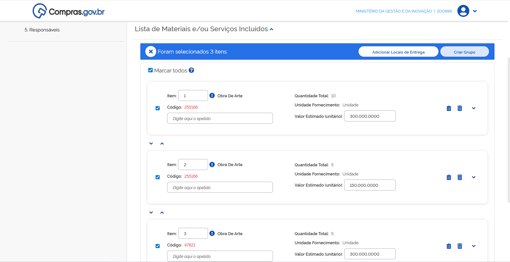

**Passo 39:** Dê um Apelido para o grupo.

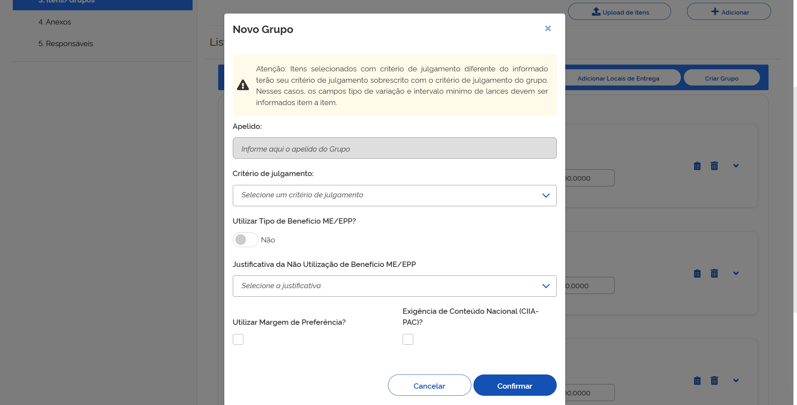

**Passo 40:** Selecione o critério de julgamento e clique em “Confirmar”.

**Passo 41:** Atribua os benefícios ao grupo e salve.

**Passo 42:** Finalize a configuração dos itens do grupo e clique em “Salvar”.

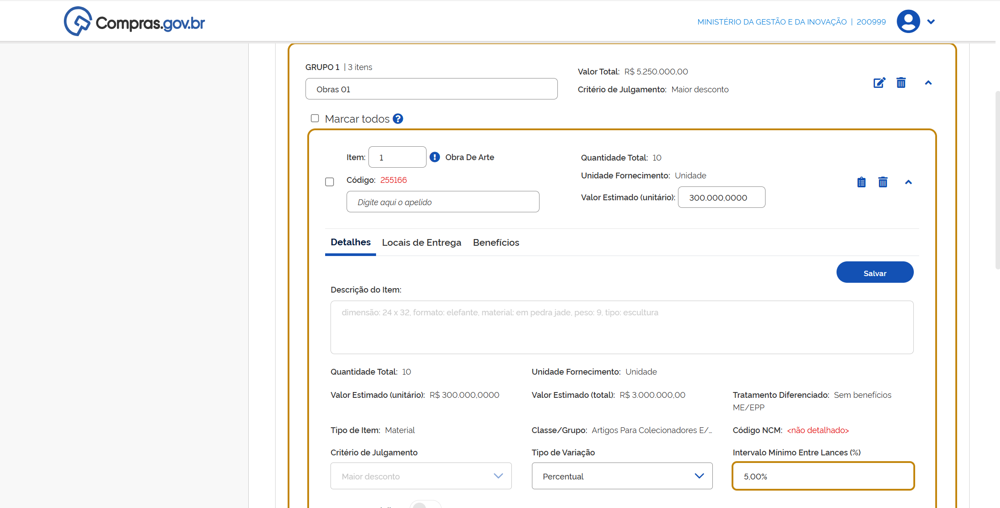

---

## Inclusão de Anexos e Artefatos Vinculados

**Passo 43:** Na aba **Anexos**, podem ser vinculados artefatos digitais da contratação ou documentos complementares. Para vincular os artefatos, clique em “+Vincular”.

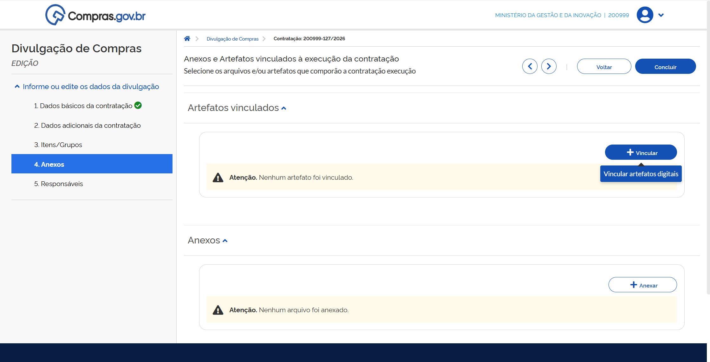

**Passo 44:** Selecione o tipo de artefato para pesquisa.

**Passo 45:** Selecione o documento e clique em “Vincular”.

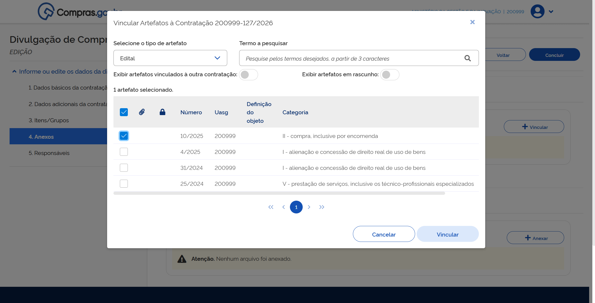

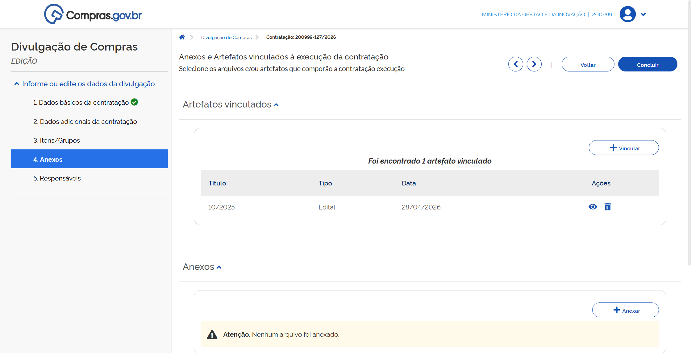

**Passo 46:** Para anexar outros documentos, clique em “+Anexar”.

**Passo 47:** Selecione o tipo de anexo para pesquisa.

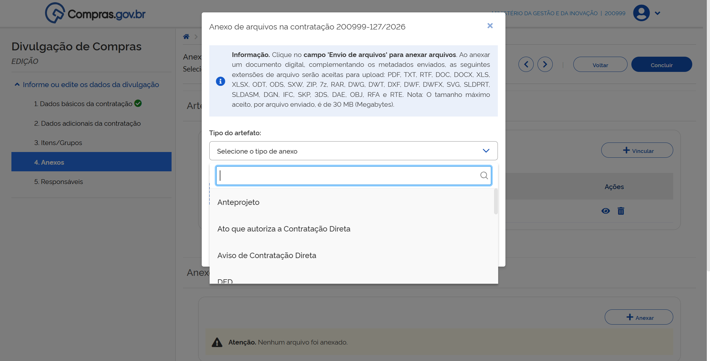

**Passo 48:** Selecione o arquivo e clique em “Anexar”.

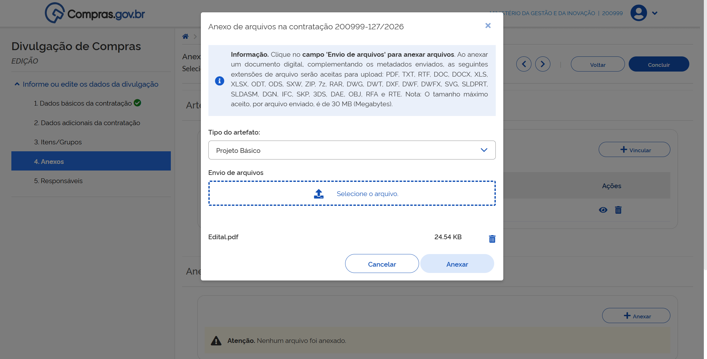

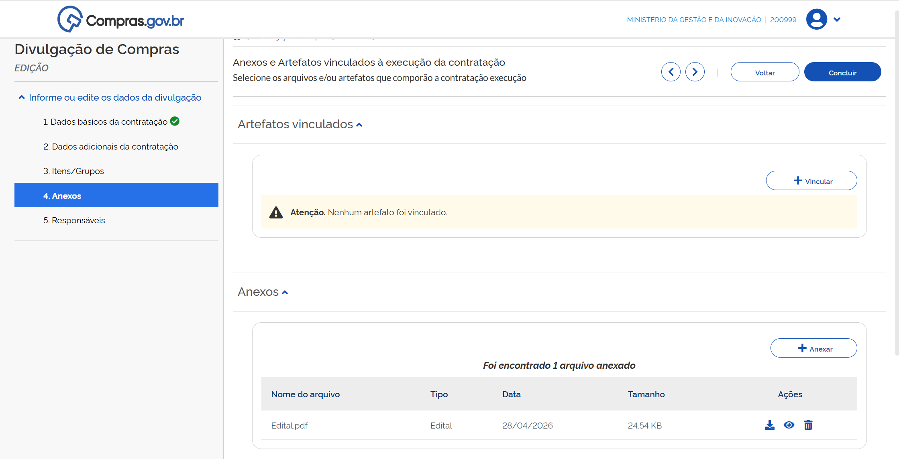

 

  <strong>ATENÇÃO:</strong>  É necessário juntar, no mínimo, o edital aos arquivos anexos.

 

---

## Inclusão de Responsáveis

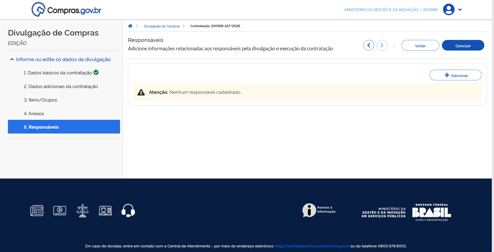

**Passo 49:** Na aba **Responsáveis** devem ser incluídas informações dos responsáveis. Para isso, clique em “+Adicionar”.

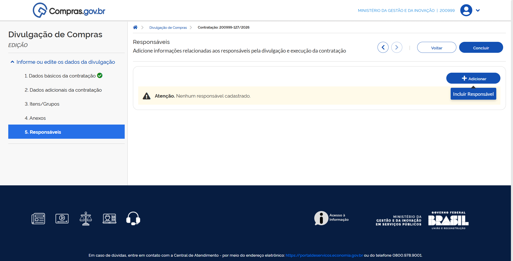

**Passo 50:** Insira o CPF e o e-mail do responsável, selecione seu Cargo/Função e clique em “Adicionar”.

> **IMPORTANTE:** É necessário indicar, entre os responsáveis, um servidor como responsável pela publicação na Imprensa Nacional que deverá ser cadastrado com a Imprensa Nacional para essa função.

> **Atenção!** Devem ser inseridos, no mínimo, os responsáveis:
> * **Pregão** - Pregoeiro  
> * **Concorrência e Concurso** - Agente de contratação ou membro de comissão de contratação  

---

## Divulgação da Contratação

**Passo 51:** Depois de preencher essas informações, clique em “Concluir” para que a contratação seja encaminhada para publicação.

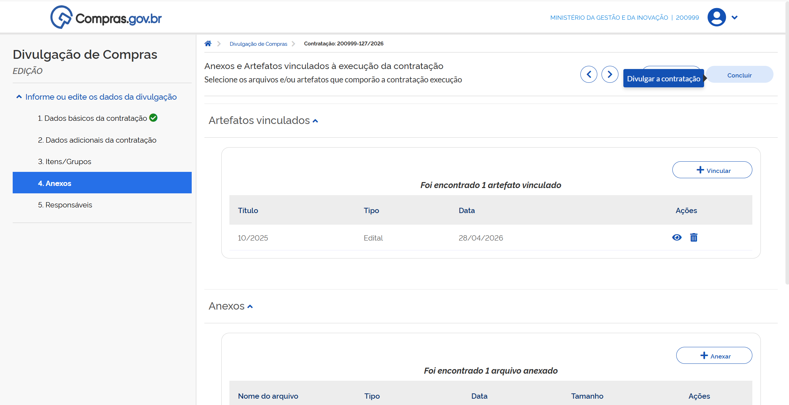

**Passo 52:** Para visualizar a prévia da matéria do Diário Oficial da União, clique em “Visualizar prévia”.

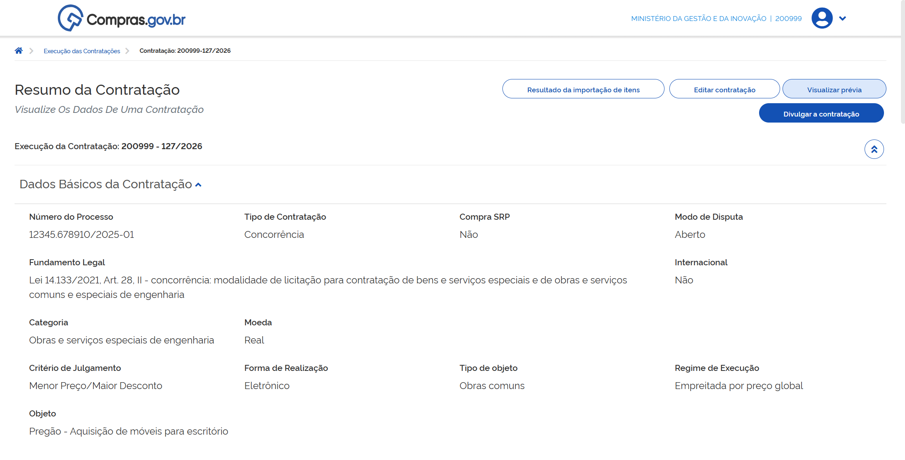

Verifique os dados apresentados.

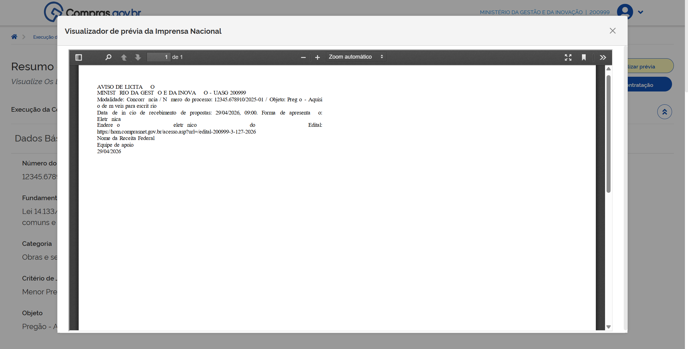

**Passo 53:** Na página de Resumo da Contratação clique em “Divulgar a contratação”.

A contratação será divulgada no PNCP.

Para visualizá-la, vá para a tela inicial do Novo Divulgação de Compras, escolha a aba “Contratações em Andamento” e clique no número da contratação.

Sua contratação poderá receber propostas conforme as datas especificadas na aba Dados básicos da contratação.

Após a data final, será aberta a etapa de lances. Para acompanhamento desta etapa, acesse o manual de sala de disputa.

  <button onclick="window.print()" style="background-color: #0056b3; color: white; padding: 10px 20px; border: none; border-radius: 5px; font-size: 16px; cursor: pointer; box-shadow: 0 2px 4px rgba(0,0,0,0.2);">
    🖨️ Imprimir esta página
  </button>

