

  <button onclick="window.print()" style="background-color: #0056b3; color: white; padding: 10px 20px; border: none; border-radius: 5px; font-size: 16px; cursor: pointer; box-shadow: 0 2px 4px rgba(0,0,0,0.2);">
    🖨️ Imprimir esta página
  </button>

PÚBLICO-ALVO: AGENTES DE CONTRATAÇÃO

# Manual sistema Compras.gov.br - Pregão Eletrônico pela Lei nº 13.303/2016 no Novo Divulgação de Compras (Novo DC)

Agora, **empresas estatais podem realizar pregões eletrônicos ou presenciais fundamentados na Lei nº 13.303/2016 pelo Novo Divulgação de Compras (Novo DC)**, disponível no sistema Compras.gov.br.  

Os pregões das empresas estatais poderão ser realizados em processos previstos no Planejamento e Gerenciamento de Contratações (PGC) ou em novo processo de compra.  

Neste tutorial, abordamos o <strong>passo a passo para publicação de um pregão eletrônico no Novo Divulgação de Compras (Novo DC) partindo de um novo processo</strong>. Se a contratação já estiver prevista no Planejamento e Gerenciamento das Contratações (PGC), [clique aqui](02-divulgar-contratacao.md) e vá direto para a segunda etapa deste tutorial.

  <strong>OBSERVAÇÃO:</strong> Contratações no Sistema de Registro de Preços estão no manual <strong>CONTRATAÇÕES SRP</strong>.

---

## Formatos de Visualização

Para garantir a melhor experiência de consulta e atender às diferentes necessidades de leitura, disponibilizamos a documentação em múltiplos formatos de acesso, quais sejam:

* [Padrão - formato html com paginação](./)
* [Página única - formato html em página única (impressão)](versao-impressao.md)

# PROCEDIMENTOS PARA REALIZAÇÃO DE LICITAÇÕES ELETRÔNICAS TRADICIONAIS

---

# Primeira Etapa: Criar a contratação

Nesta etapa, preencheremos os dados básicos, o fundamento legal e as informações essenciais para a publicação do certame.

---

**Passo 1:** Acesse o Portal de Compras do Governo Federal e clique em “Acesso ao Sistema”.

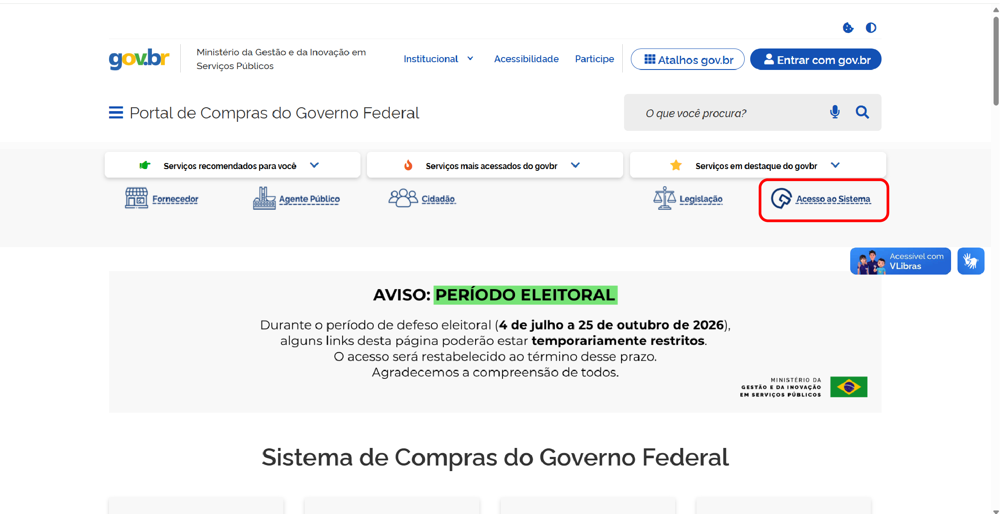

---

**Passo 2:** Escolha o perfil Governo e clique em “Entrar com Gov.br”.

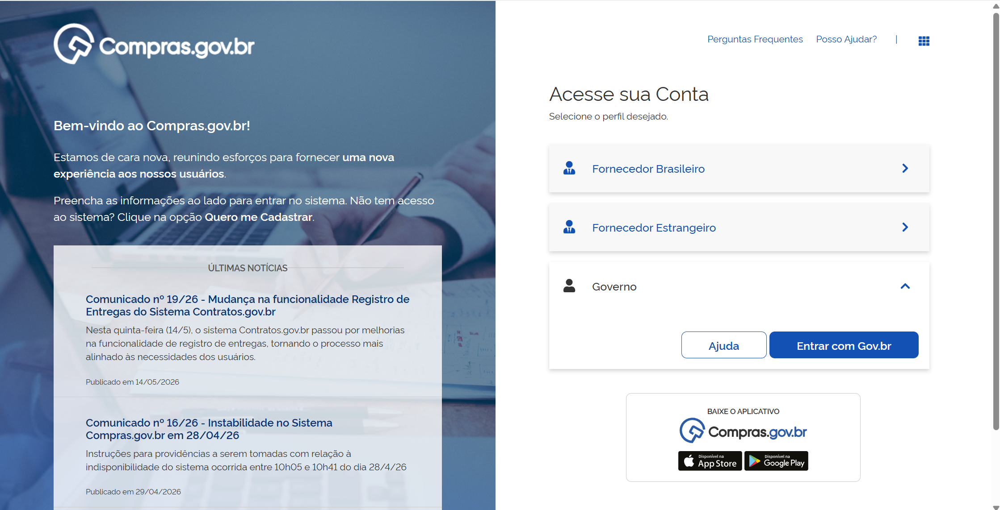

---

**Passo 3:** Na área de trabalho do usuário Governo, clique em “Novo Divulgação de Compras”.

---

**Passo 4:** E em seguida clique em “+Criar”.

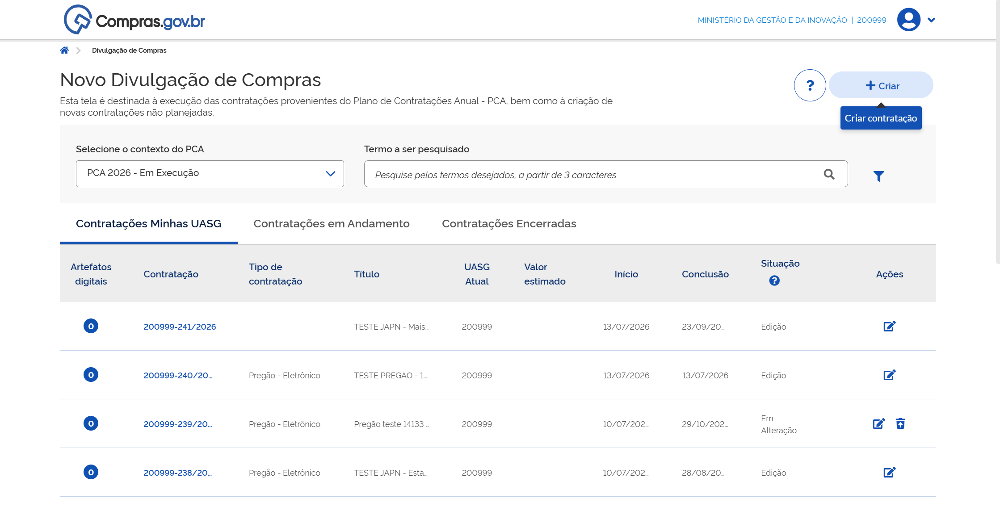

---

**Passo 5:** Preencha todas as informações relacionadas ao processo e clique em “Concluir”.

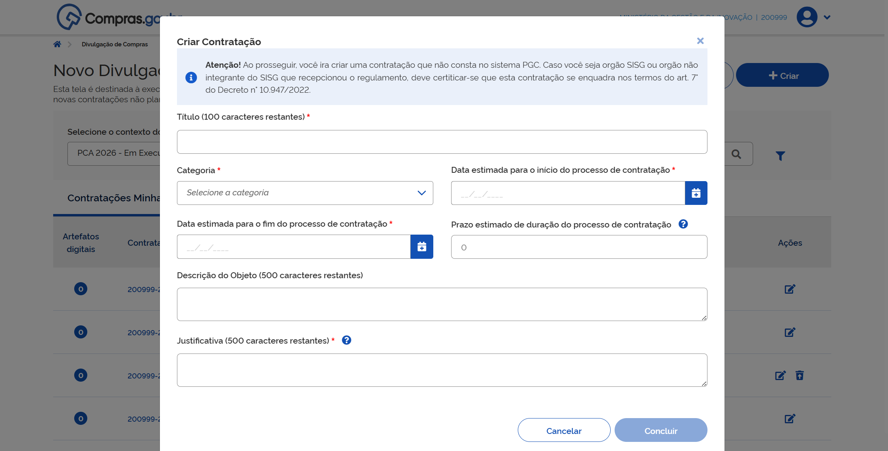

 

# Segunda Etapa: Divulgar a contratação

Nesta etapa, preencheremos os dados básicos, o fundamento legal e as informações essenciais para a publicação do certame.

---

### Preenchimento de dados da contratação

**Passo 6:** Encontre a contratação desejada na aba **Contratações Minhas Uasg** e clique em “Editar”.

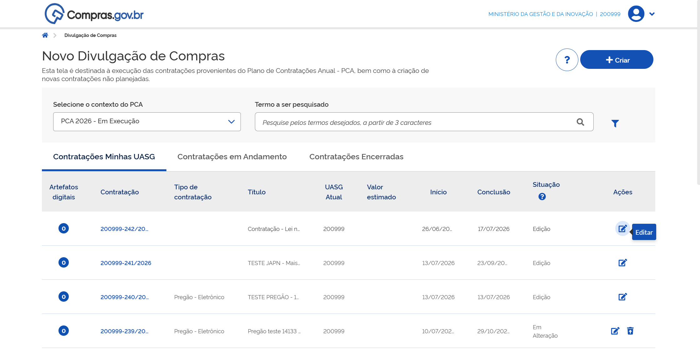

---

**Passo 7:** Na aba **Dados Básicos da Contratação**, preencha o número do processo, o número de controle interno da UASG e, no **Tipo de contratação**, escolha a modalidade de licitação.
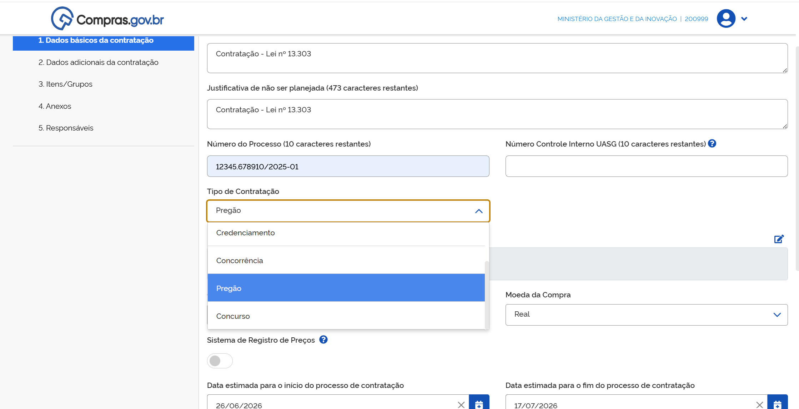

  <strong>OBSERVAÇÃO:</strong> O número de controle interno da UASG tem por objetivo permitir que cada órgão tenha seu controle de processos, registrado no sistema para melhor rastreabilidade. O preenchimento desse número é opcional.

---

**Passo 8:** Para definir o **Fundamento legal** da contratação, clique no ícone de lápis.

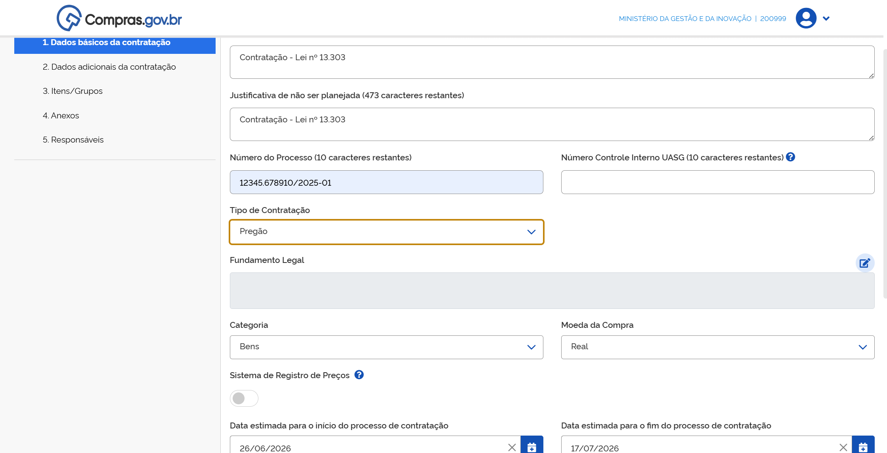

Navegue pela lista de fundamentos legais disponíveis no sistema.

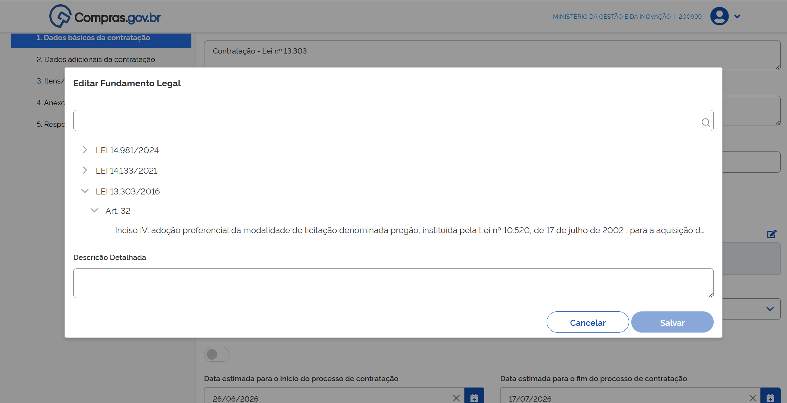

Detalhe os fundamentos legais disponíveis e, quando localizar a opção adequada, clique sobre o texto e depois em “Salvar”.

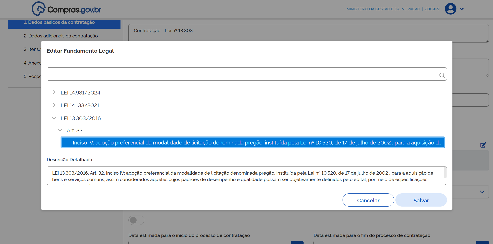

---

**Passo 9:** Em **Modo de disputa**, selecione a opção de acordo com a definição do edital – *aberto, fechado, aberto/fechado ou fechado/aberto*.

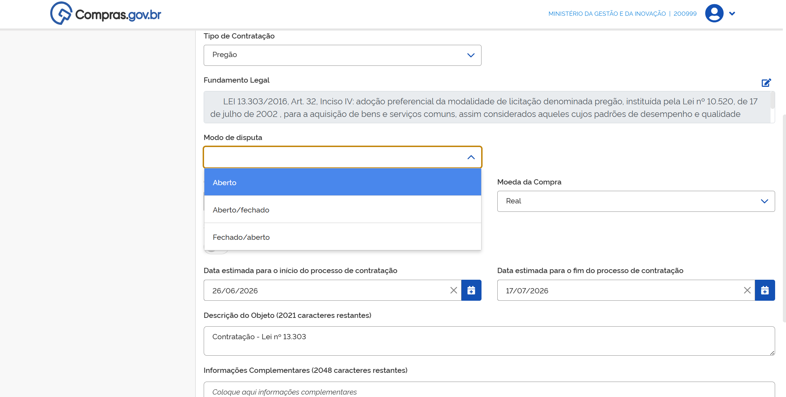

Os modos de disputa exibidos em tela variam de acordo com a modalidade da licitação. 

---

**Passo 10:** Em **Critério de julgamento**, o sistema trará a opção padrão (*default*) “Menor preço/maior desconto” por se tratar de pregão.

---

**Passo 11:** Em **Forma de realização**, selecione entre “eletrônico” e “presencial”.

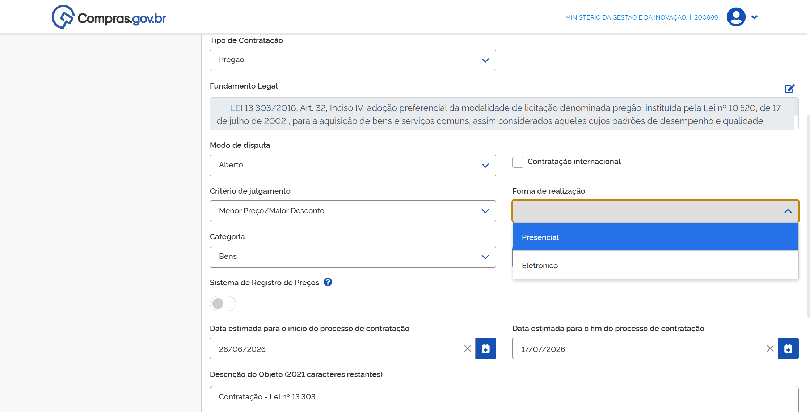

  <strong>OBSERVAÇÃO:</strong> 
    - A opção <strong>Eletrônico</strong> encaminhará seu processo para a sala de disputa virtual, onde fornecedores interessados se conectarão ao seu processo de forma virtual.
    - A opção <strong>Presencial</strong> resultará na realização de sessão pública presencial e no posterior registro de resultados.

---

**Passo 12:** Selecione o **Tipo de objeto** a ser licitado na lista apresentada no sistema. Essa opção ajudará o sistema a definir seus prazos mínimos de publicidade.

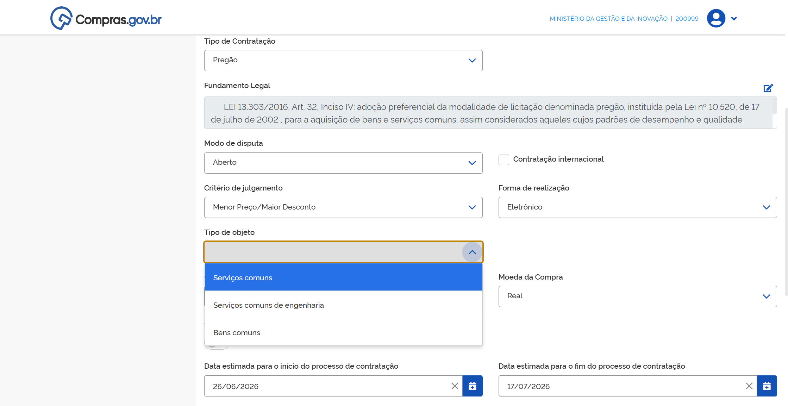

---

**Passo 13:** Para obras e serviços de engenharia, o sistema apresentará o campo para informar o **Regime de execução** do contrato.

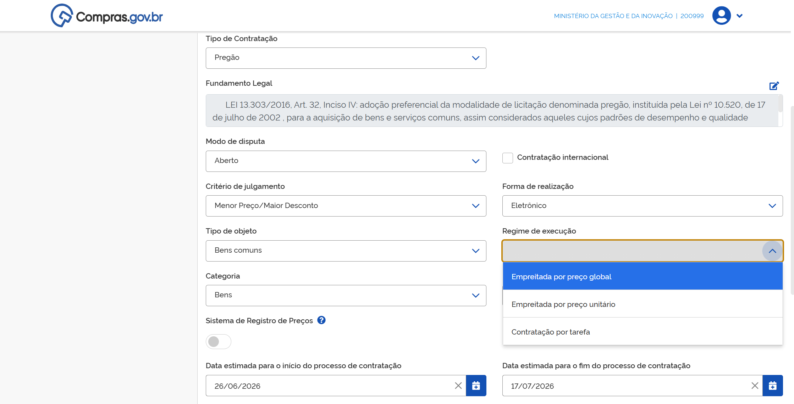

---

**Passo 14:** Preencha os campos de **Categoria** e **Moeda da Compra**. As demais informações na tela correspondem às que foram inseridas na criação da contratação e poderão ser editadas caso seja necessário. 

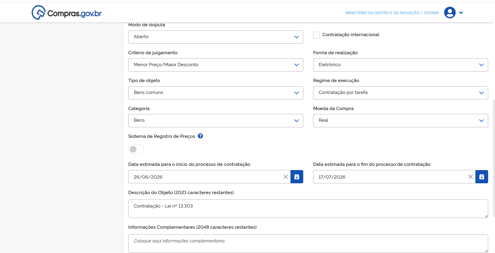

---

**Passo 15:** Na aba **Dados adicionais da contratação**, preencha os dados do empenho para a publicação no Diário Oficial da União. Se necessário, consulte os dados de seu órgão para o preenchimento correto das informações.

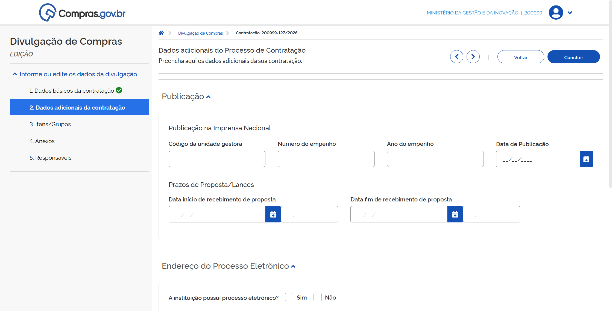

**Passo 16:** Preencha as datas importantes do seu certame - Início e fim de recebimento de propostas. Seu certame será iniciado na data e na hora que você digitar no campo “Data fim de recebimento de propostas”.

**Passo 17:** Por fim, caso o órgão ou entidade tenha processo eletrônico, preencha os dados de endereço do processo eletrônico referente a contratação e o Tipo de recurso, que poderá ser “Internacional”, “Federal”, “Distrital”, “Estadual” ou “Municipal”.

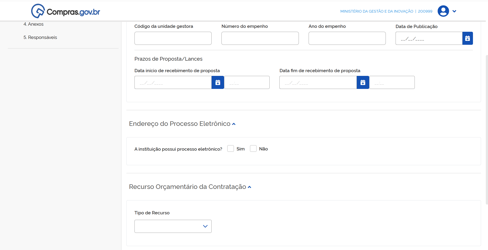

 
